# Hotel Reservation System - Customer Service

[](https://sonarcloud.io/summary/new_code?id=arghyagiri_hrs-customer-service)
[](http://www.apache.org/licenses/LICENSE-2.0.html)

[Spring Boot](http://projects.spring.io/spring-boot/) based app.

### Business Workflows:

* 1. Customer Registration
* 2. Update Profile
* 3. View Hotel Listings
#### Design Patterns & Annotations: 
* Use API Gateway to route requests to Customer Service.

#### Interactions: 
* Will interact with Hotel Management Service for viewing listings.

## Requirements

For building and running the application you need:

- [JDK 17](https://www.oracle.com/java/technologies/javase/jdk17-archive-downloads.html)
- [Maven 3](https://maven.apache.org)

## Running the application locally

There are several ways to run a Spring Boot application on your local machine. One way is to execute the `main` method
in the `com.tcs.training.hotelRoom.CustomerApplication` class from your IDE.

Alternatively you can use
the [Spring Boot Maven plugin](https://docs.spring.io/spring-boot/docs/current/reference/html/build-tool-plugins-maven-plugin.html)
like so:

```shell
mvn spring-boot:run
```

## Local Application Urls

### Base Url

http://localhost:8084

### Swagger UI

http://localhost:8084/swagger-ui/index.html

## Application endpoints:

* Retrieve all customers: ```GET /all-customers```
* Customer Registration: ```GET /signup```

## Sign Up Flow

### 1. Customer Sign Up Page
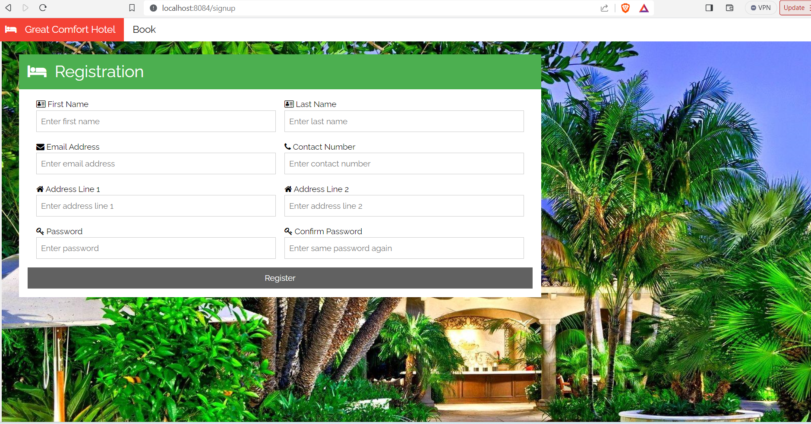

### 2. Customer Data validation
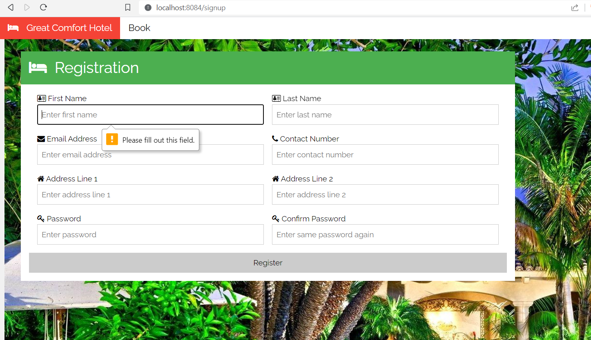

### 3. Data Inputs
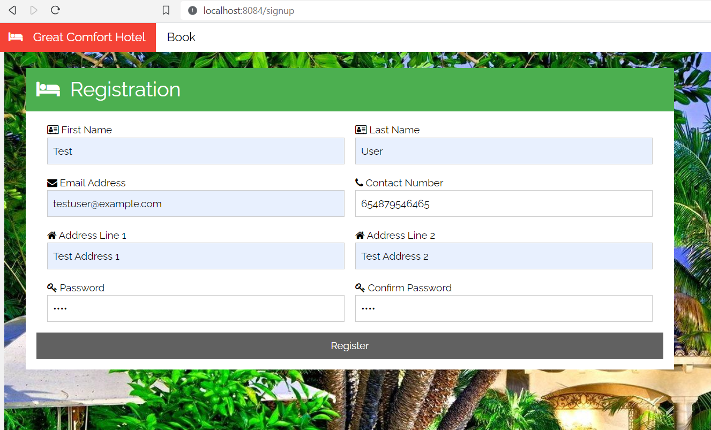

### 4. Successful registration
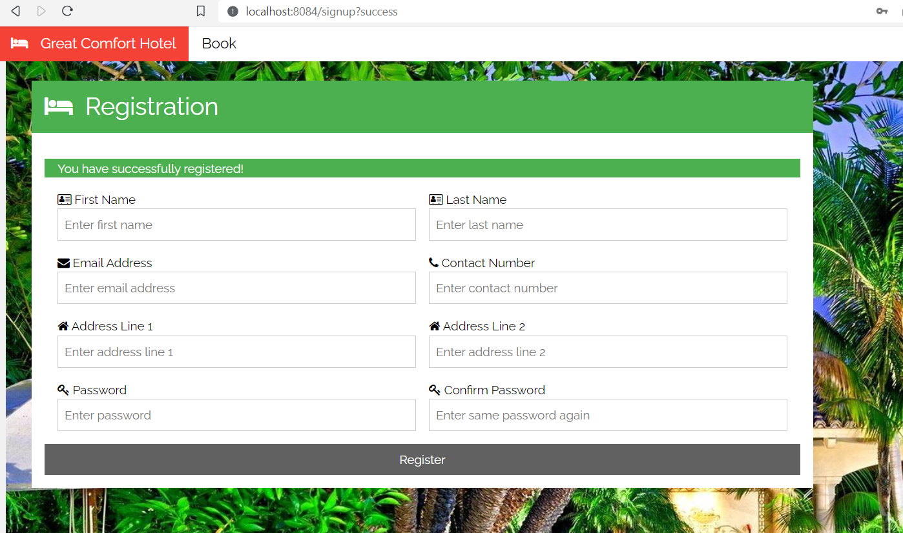

### 5. Notification Process Event trigger
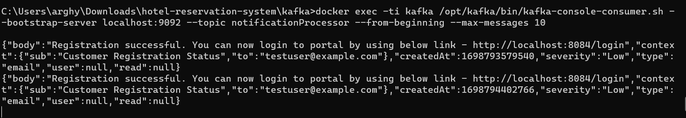

### 6. Notification Service consumes and process this event
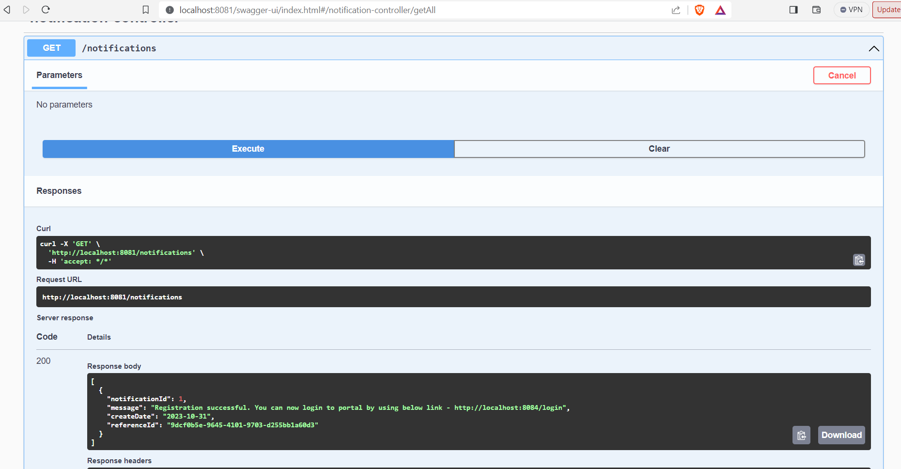

### 7. Notification Service send e-mail to hotelRoom registered email address

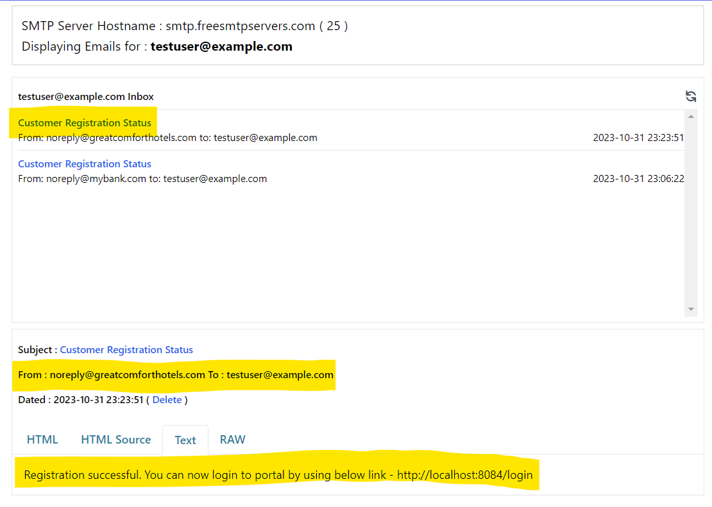


## Reservation Flow

### 1. Create Amenities in Hotel Management Service
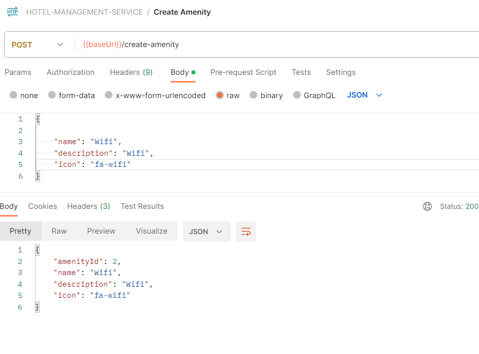

### 2. Create Room Listing in Hotel Management Service
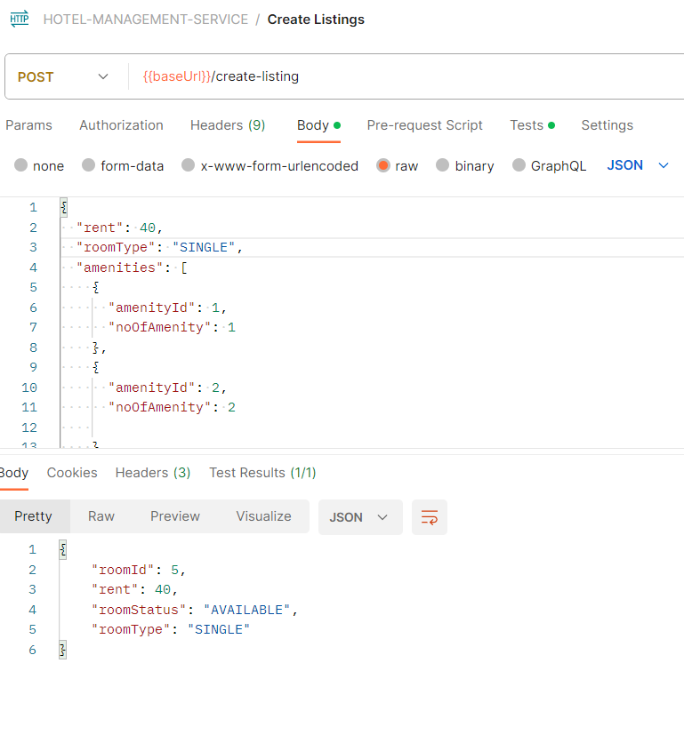

### 3. View listing of rooms[from Hotel Management Service]
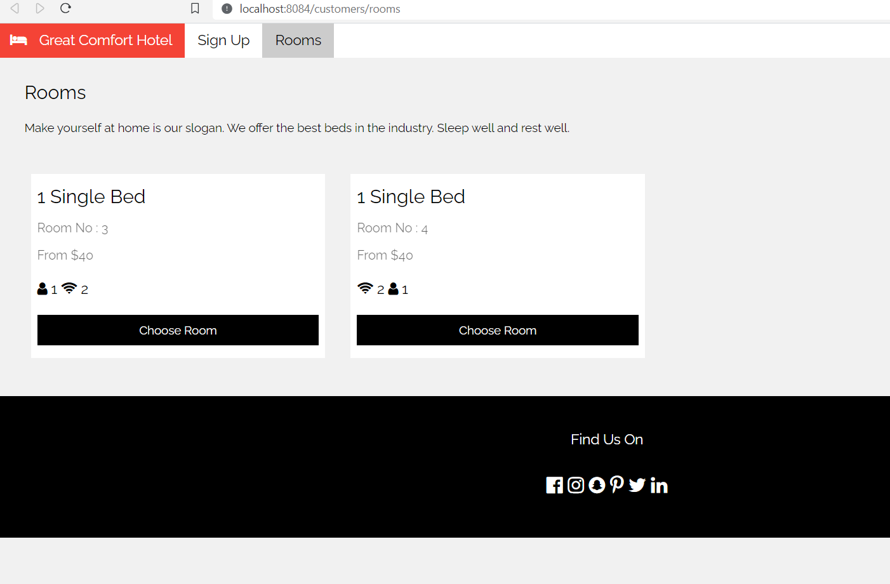

### 4. Select room and select reservation dates
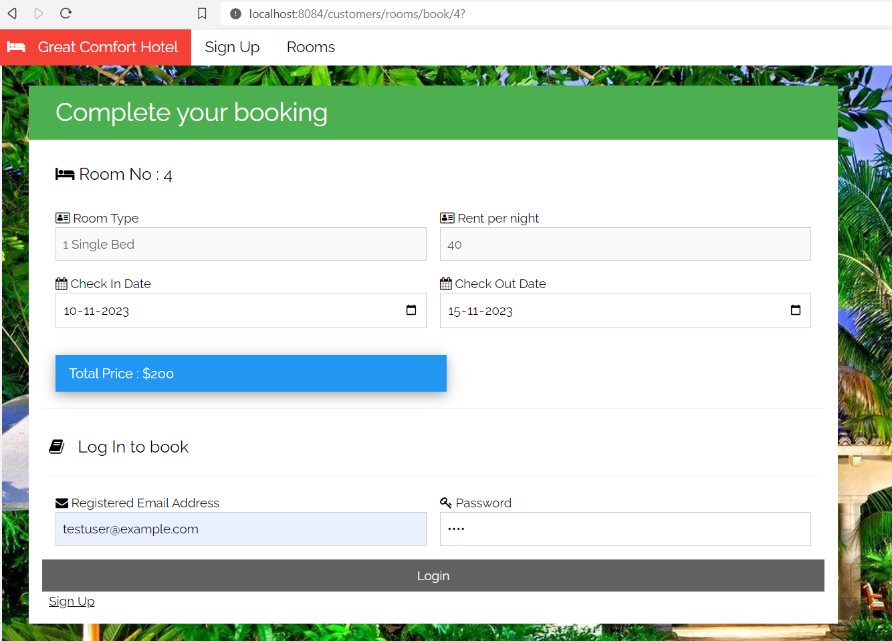

### 5. Provide payment details
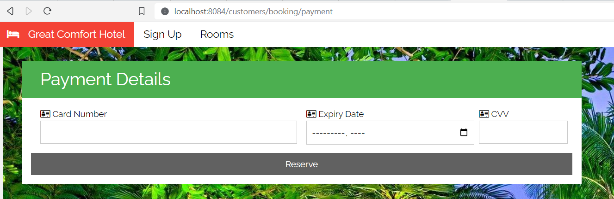

### 6. If payment failed, room reservation is not completed and room is still shown as available
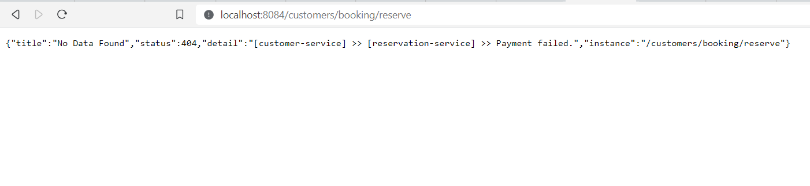
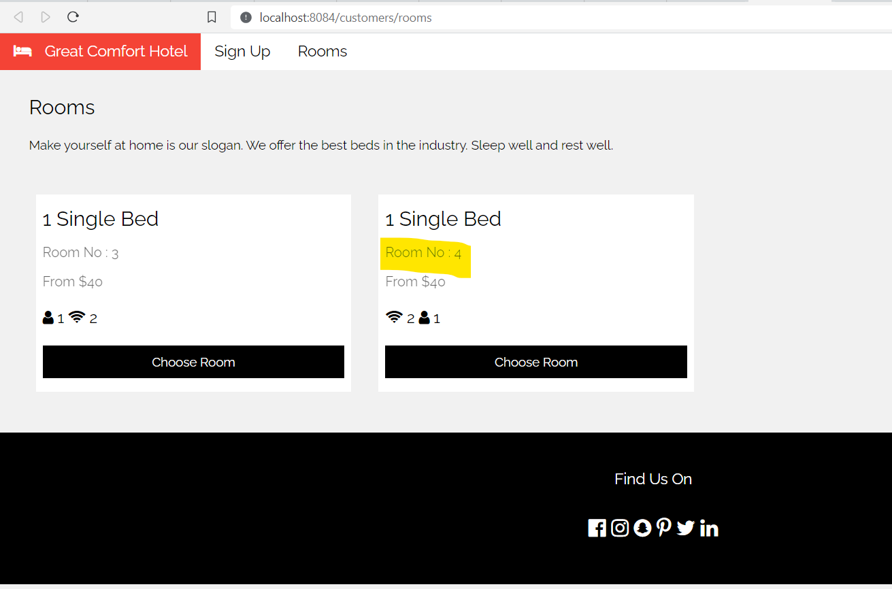

### 7. If payment is successful, room is booked and notification is sent
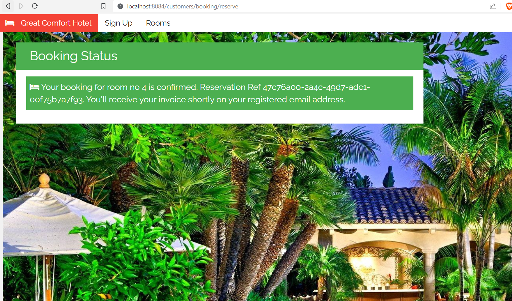
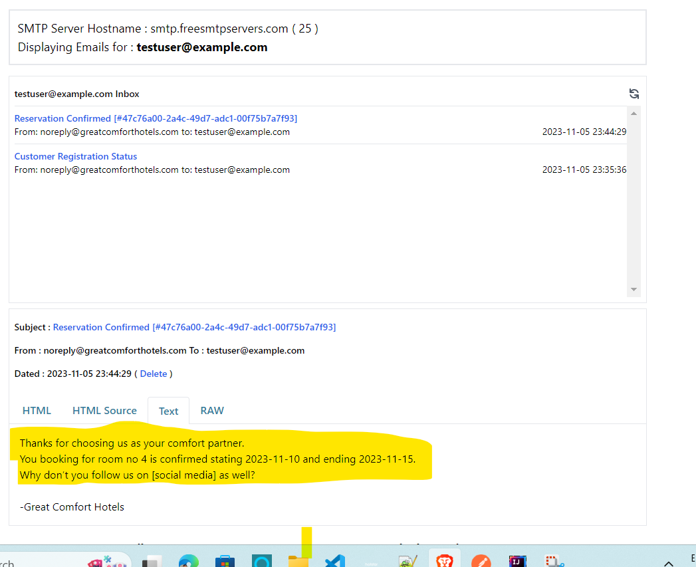


## Reservation Cancellation Flow

### 1. User login to check bookings
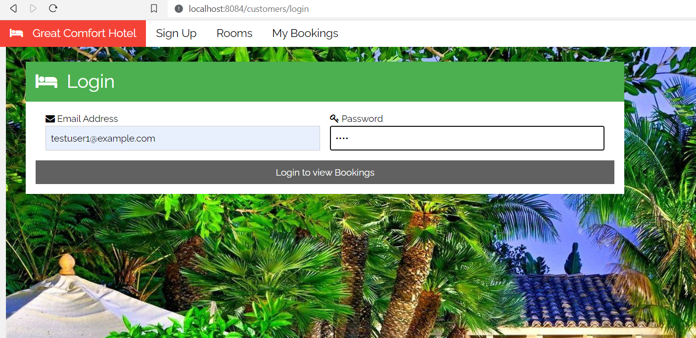

### 2. Booking list is shown
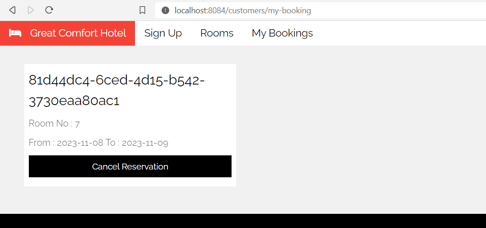

### 3. Cancel reservation
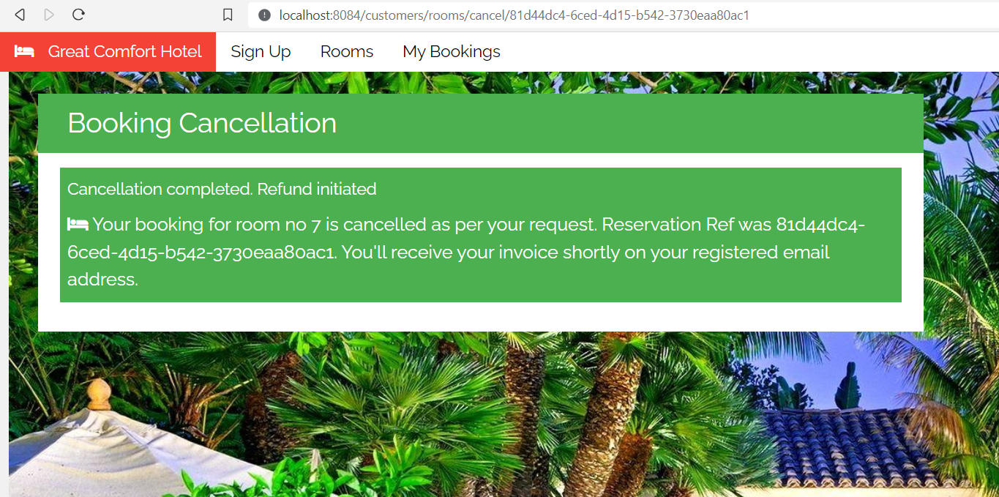

### 4. Cancellation notification sent


## Copyright

Released under the Apache License 2.0. See
the [LICENSE](https://github.com/arghyagiri/microservice-e2/blob/main/LICENSE) file.

